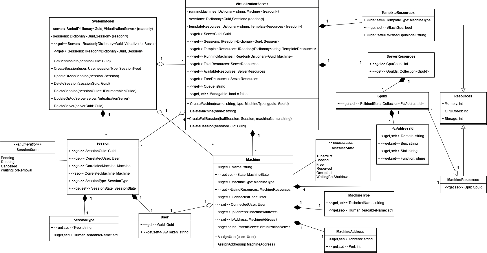

# OneClickDesktop Backend Classes

C# library containing common classes used by other modules.

Model created by this library contains information about:

- Available virtualization servers.
- Available resources on servers.
- Currently running machines and resources used by them.
- Sessions in global view and per virtualization server.

Library also provides classes for data transfer objects used in RabbitMQ communication by other modules (suffix `RDTO`).

## Namespaces

Library consists of namespaces:

- `OneClickDesktop.BackendClasses.Model`: contains classes used for storing and management of system model. All functions perform actions only on model. All other actions, like data transfer, need to be performed manually. Methods perform basic validation to preserve model integrity. Business logic validation needs to be performed manually.

- `OneClickDesktop.BackendClasses.Communication`: contains classes describing messages and data needed to properly deserialize them.

## Documentation

Documentation is created using [docfx](https://github.com/dotnet/docfx). Configuration is located in file [`toc.yml`](/toc.yml). To create new PDF run `docfx`. Generated file will be located in `_site_pdf` directory.
