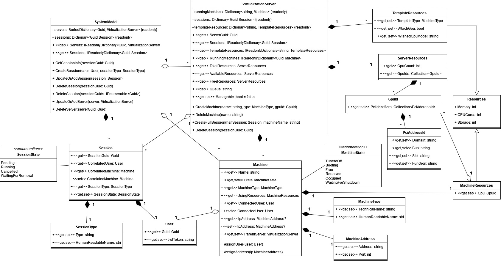

# OneClickDesktop Backend Classes

C# library containing common classes used by other modules.

Model created by this library contains information about:

- Available virtualization servers.
- Available resources on servers.
- Currently running machines and resources used by them.
- Sessions in global view and per virtualization server.

Library also provides classes for data transfer objects used in RabbitMQ communication by other modules (suffix `RDTO`).

